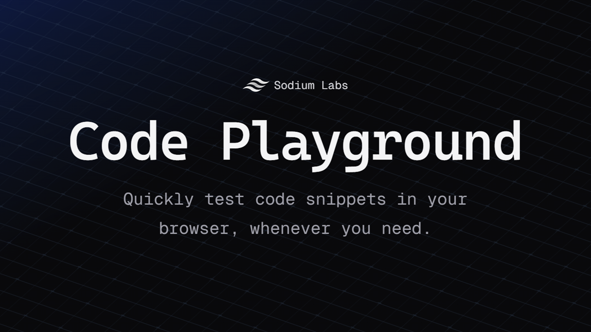

<div align="center">
<br />
    <h1>Code Playground</h1>
    <p>
        <a href="https://discord.gg/8PDXWSHH7k"></a>
        <a href="https://github.com/sodium-labs/playground/commits/main"></a>
    </p>
</div>



# About

A fast, lightweight in-browser code editor built for quick experimentation.  
Test your code snippets in real-time — anytime, anywhere.

Try it on: https://playground.sodiumlabs.xyz

# Getting started

```sh
git clone https://github.com/sodium-labs/playground.git
cd playground
npm install
npm run dev
```

## Support the Project

If you enjoy using Code Playground and want to help support its development, consider becoming a patron. Every contribution helps keep the project alive and growing.

[Support on Patreon](https://www.patreon.com/sodiumlabs)

# Fonts

- Cascadia Code font source: https://github.com/microsoft/cascadia-code
